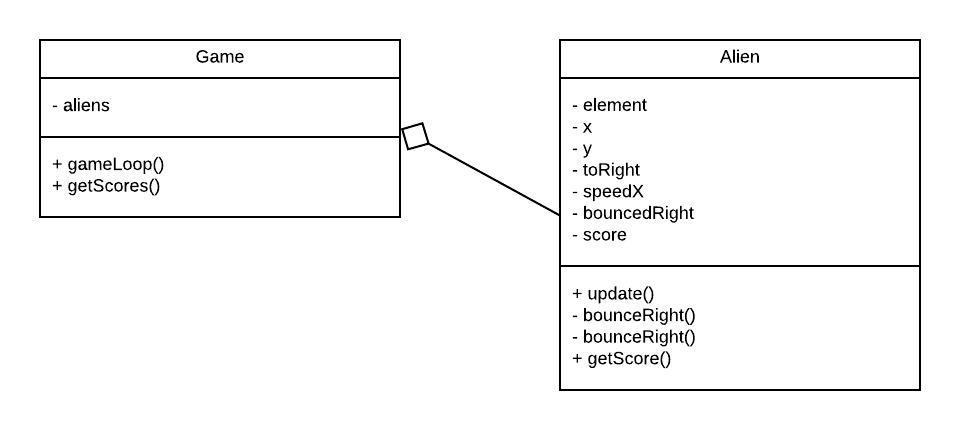

# Week 5: extra ondersteuning les

In deze les hebben we een simpel alien spelletje uitgewerkt, waarin:
- Een UML diagram aangemaakt
- Een karakter (alien) van links naar rechts beweegt
- Zodra het karakter rechts is, deze hier even stopt

Na de les zijn, in overleg de volgende dingen nog toegevoegd:
- Commentaar
- Score toevoegen aan karakter (alien)
- Score telt op, zodra de karakter de linkerkant bereikt
- Vanuit game de scores optelen van alle karakters

