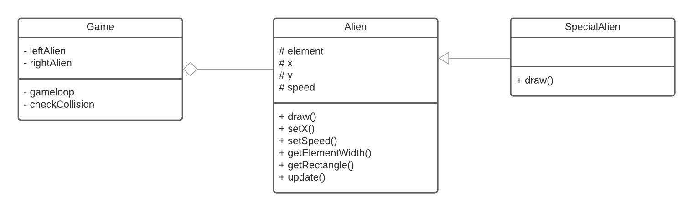

# Week 6: extra ondersteuning les

In deze les hebben we een simpel alien spelletje uitgewerkt, waarin:
- Een UML diagram aangemaakt
- Een karakter (alien) van links naar rechts beweegt
- Een karakter (special alien) van rechts naar links beweegt
- Een collision word gedecteerd tussen de twee aliens

