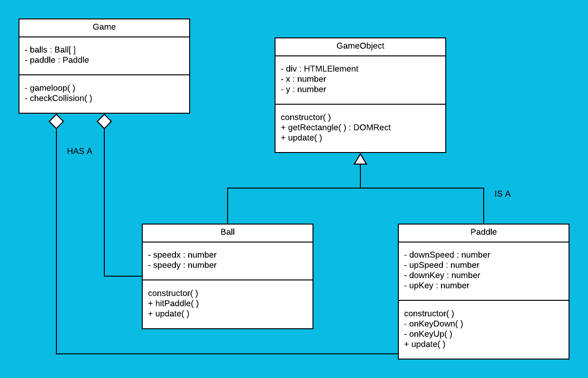

# CMTTHE04 Week5 oefening 1

## Inheritance

In de uitwerking hebben we een class `GameObject` gemaakt. Hierin zijn de eigenschappen en functies opgenomen die `Ball` en `Paddle` gemeenschappelijk hebben. 

## Klassendiagram
